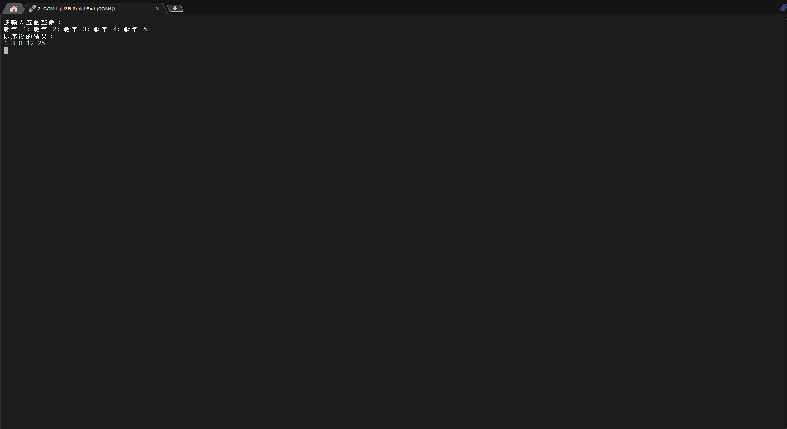
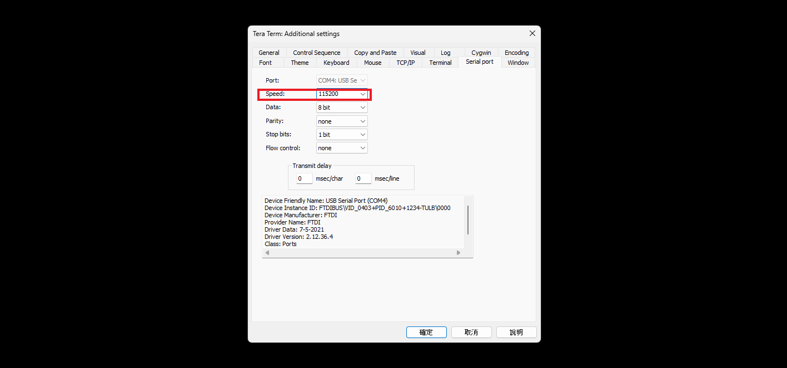
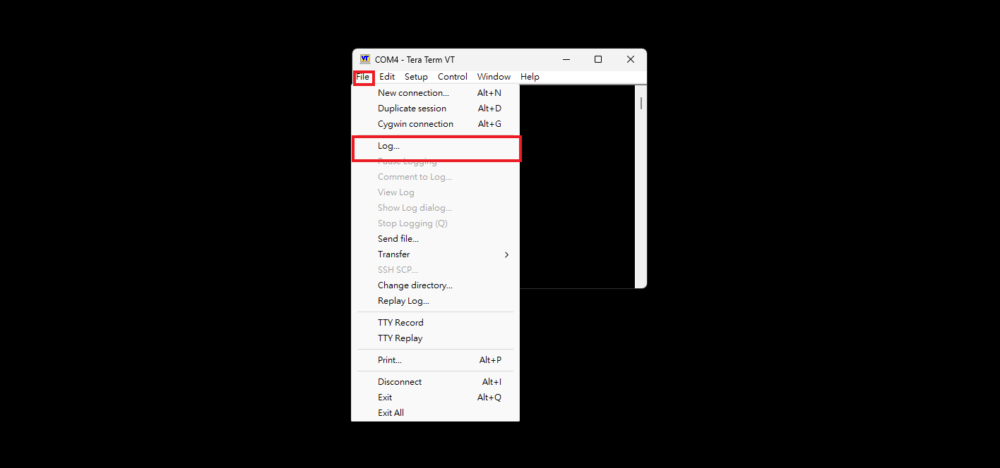
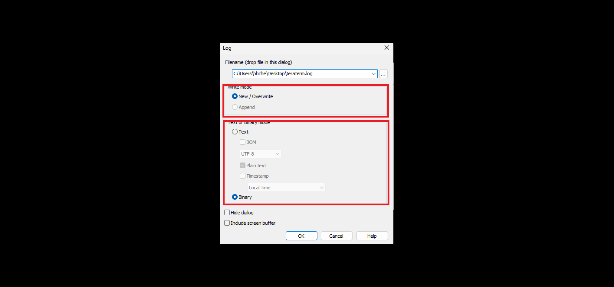
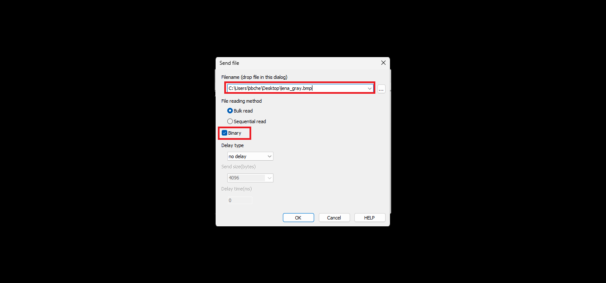
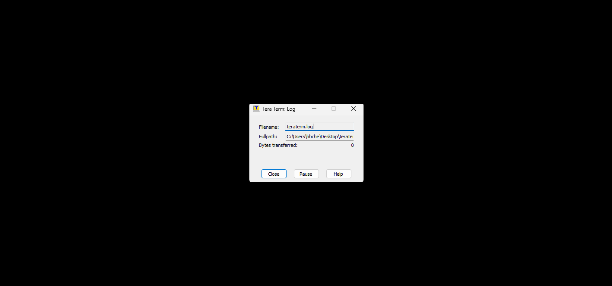

# FPGA Design Lab1

使用 PYNQ-Z2 上的 Zynq Processor 操作簡單的 C/C++  Project。

> 💡 **Hint：** Block design 可以參考 Part1 的設計即可。

## Problem 1
使用鍵盤輸入五個非負整數後，透過 PS 端 (軟體) 去將此數列由小到大排序。

參考輸出結果 :  



## Problem 2 
在這個Lab中，學習如何使用 UART 在 PC 和 PYNQ 之間進行通訊。PC 會透過 UART 傳送一張圖片到 PYNQ，PYNQ 會將原始圖片經過`二值化處理 (Binarization)` 後，最後再將轉換後的圖片傳回給 PC。  

>🔍 怎麼做（二值化原理）  
    對於灰階圖像中每個像素值（0～255），設定一個 threshold，如果像素值高於閾值，就設定為白色（1）；否則設定為黑色（0）：
```python
Binarization:

if pixel > threshold:
    pixel = 255  # 白色
else:
    pixel = 0    # 黑色
```


___
### Step 1 
在這個 problem 中會用到 `Teraterm` 以及 `HxD` 兩個工具。

下載連結:    
Teraterm  : https://teratermproject.github.io/index-en.html  

HxD  : https://mh-nexus.de/en/downloads.php?product=HxD20  

___
### Step 2
照著 Part1 的步驟完成 block design 並且建立 platform 、 Application。

___
### Step 3 
打開 `Application -> Source -> lscript.ld`  
更改 `Heap Size` 的值。 (將圖片存入該隻程式的Heap中) 


___
### Step 4  
加入 src 檔案中的 main.c ， 自行完成剩餘部分。  


> BMP 檔案簡介  
    BMP（Bitmap Image File）是由 Microsoft 開發的點陣圖影像格式，副檔名為 `.bmp`。主要用於儲存靜態影像，常見於 Windows 系統。
>  特點  
    - 📁 **無壓縮格式**：圖像品質高，但檔案較大。  
    - 🎨 **支援多種色彩深度**：如 1、4、8、24、32 位元。  
    - 📐 **像素逐行儲存**：通常由下往上排列。  
    - 🖼️ **支援透明度**：僅 32-bit BMP 有 alpha 通道。  
    - 💻 **跨平台支援**：大多數系統與工具可讀取。 

>  常見用途  
    - Windows 系統內建圖像格式（如小畫家）  
    - 測試圖像輸出、色彩資料  
    - 儲存不需壓縮的高品質圖像  


___
### Step 5
依序點選  
`Platform -> Build` 
`Application -> Build -> Run`  

___
### Step 6  利用 Tera Term 傳輸影像資料
開啟 `Teraterm`， 選擇 Serial 。  

設定 Baud rate 。




建立 log file  



___
### Step 7  開始傳輸資料

File > Send file

  

等待資料傳輸

  

Bytes transferred = 263224 (圖片大小) 表示完成

___
### Step 8  使用 HxD 來開啟 log file

用 HxD 來開啟 log file 後，點選另存新檔，檔名記得加入 .bmp 。

___
### Step 9 開啟 .bmp 檔查看結果。
  
