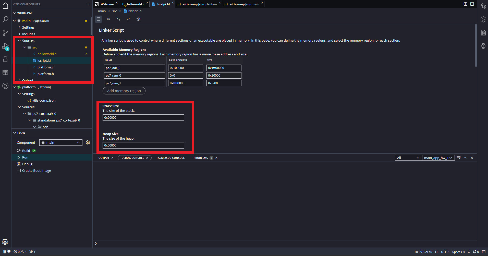
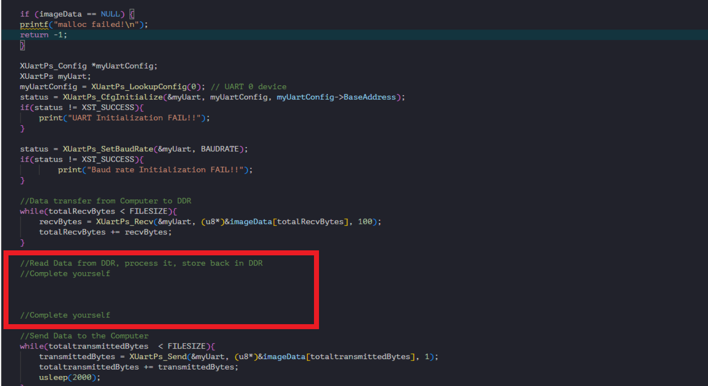
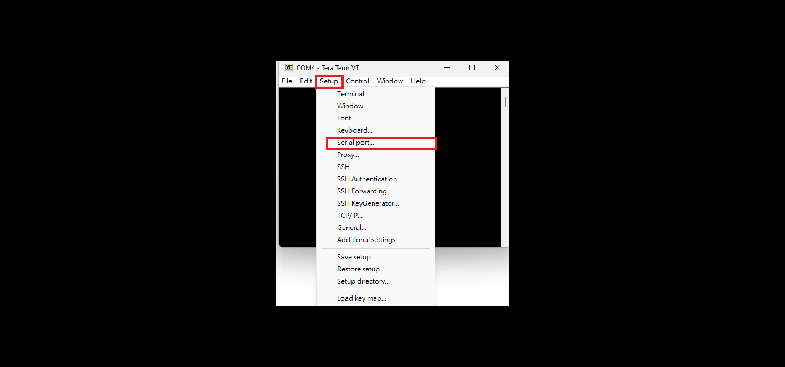

# FPGA Design Lab1

使用 PYNQ-Z2 上的 Zynq Processor 操作簡單的 C/C++  Project。

## Problem 1
使用鍵盤輸入五個非負整數後，透過 PS 端去將此數列由小到大排序。

> 💡 **Hint：** Block design 可以參考 Part1 的設計即可。

參考輸出結果 :  

## Problem 2 
在這個lab中，學習如何使用 UART 在 PC 和 PYNQ 之間進行通訊。PC 會透過 UART 傳送一張圖片到 PYNQ，PYNQ 會將原始圖片經過二值化處理後，最後再將轉換後的圖片傳回給 PC。  

## Step 1 
在這個 problem 中會用到 Teraterm 以及 HxD 兩個工具。

下載連結:  
Teraterm  : https://teratermproject.github.io/index-en.html  

HxD  : https://mh-nexus.de/en/downloads.php?product=HxD20  

## Step 2
照著 Part1 的步驟完成 block design 並且建立 platform 、 Application。

## Step 3 
打開 Application > Source > lscript.ld  
更改 Heap Size 的值。  

## Step 4  
加入 src 檔案中的 main.c ， 自行完成剩餘部分。  

## Step 5
依序點選  
Platform > Build   
Application > Build > Run  

## Step 6 
開啟 Tera Term  ， 選擇 Serial 。  

設定 Baud rate 。

