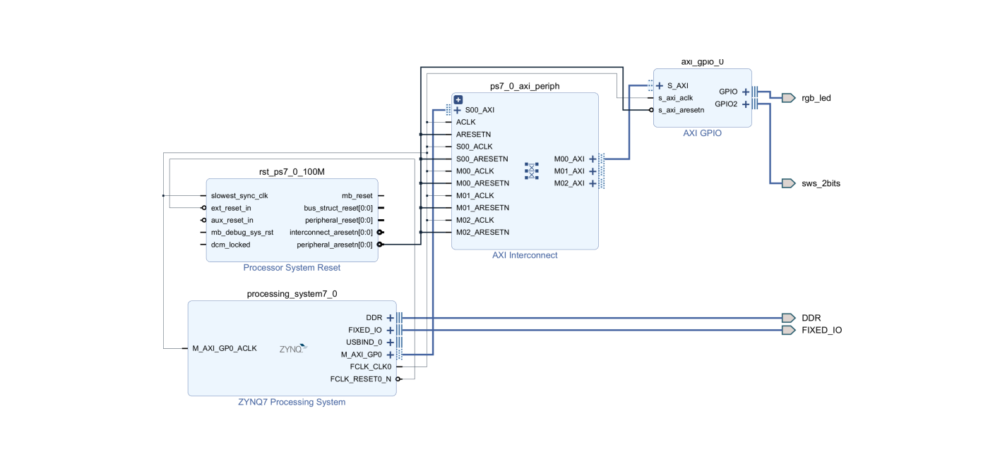
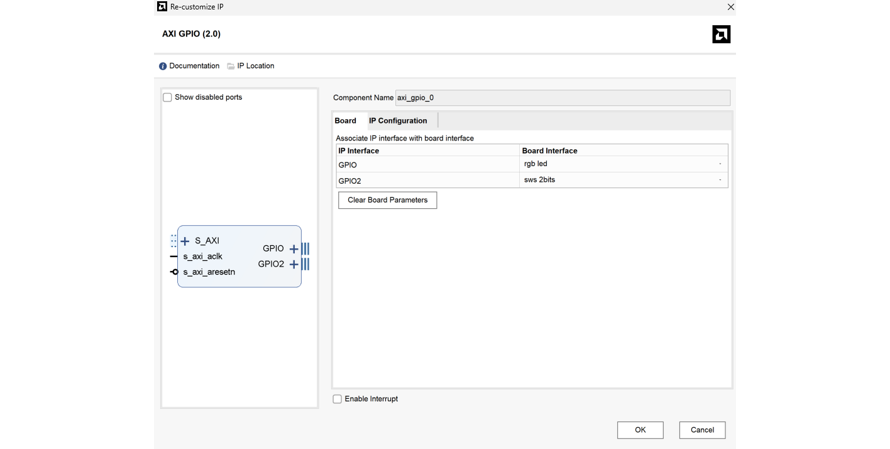

# FPGA Design Lab2

利用 AXI-GPIO 搭配 Vitis 設計一個簡易紅綠燈。

以 RGB led4 做為紅綠燈，並且在 terminal 上顯示目前的燈號以及剩餘秒數。  

每個燈號的維持時間由 sw0 來控制。  
 sw0 的切換不影響當前燈號輸出秒數，燈號維持秒數在變換燈號後才切換。

| sw0 | Green | Yellow | Red |
|-------|-------|-------|-------|
| 0 | 15 秒 | 1 秒 | 16 秒 |
| 1 |  7 秒 | 1 秒 |  8 秒 |

>💡 **Hint：**
倒數計時部分可由 C 去完成，所以這個 lab 可不加入自己製作的 IP ，僅需使用 AXI GPIO 即可。

---

## 參考 block design :

>📌 為什麼只用一個 GPIO IP ?  
一個 AXI GPIO IP 有兩個 channels ，在此次的 Lab 中，只會用到一個 output 和一個 input，因此可只使用一個 GPIO IP 。 

  
## GPIO IP 設定 : 

Channel 1 作為 rgb_led 的 6 bits output Channel。  
Channel 2 作為 switch 的 2 bits input Channel。  
 

## RGB Led 顏色設定 :

| Preview | R | G | B | Binary | Hex | Name       |
|---------|---|---|---|--------|-----|------------|
|⬛ | 0 | 0 | 0 | 000 | 0x0 | Black     |
|🟦| 0 | 0 | 1 | 001 | 0x1 | Blue      |
|🟩| 0 | 1 | 0 | 010 | 0x2 | Green     |
|🟦🟩| 0 | 1 | 1 | 011 | 0x3 | Cyan      |
|🟥| 1 | 0 | 0 | 100 | 0x4 | Red       |
|🟥🟦| 1 | 0 | 1 | 101 | 0x5 | Magenta   |
|🟨 | 1 | 1 | 0 | 110 | 0x6 | Yellow    |
|⬜ | 1 | 1 | 1 | 111 | 0x7 | White     |

___
## Demo 範例
[▶ Watch Video on YouTube](https://youtu.be/xx8UoVzsjbY)