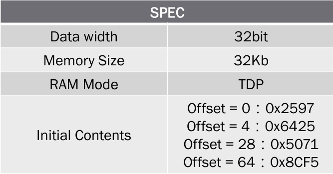
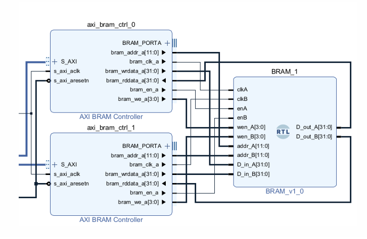
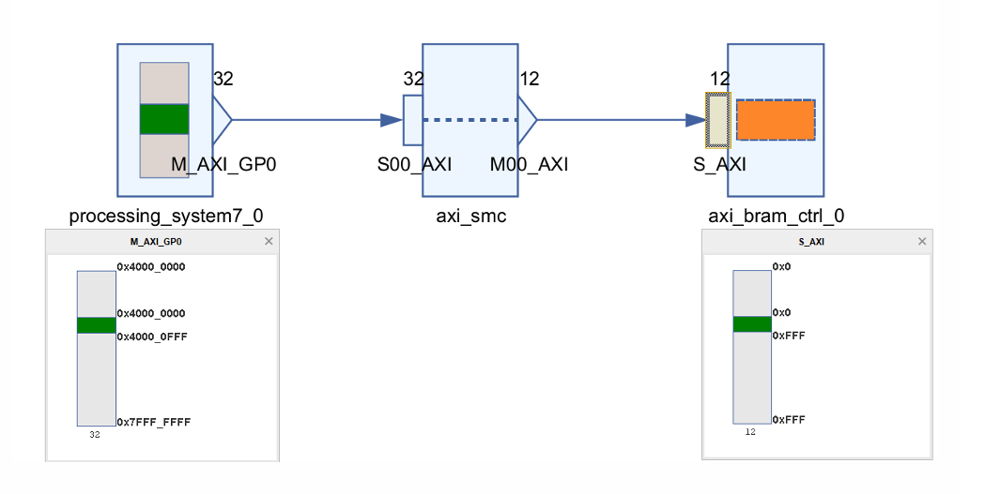
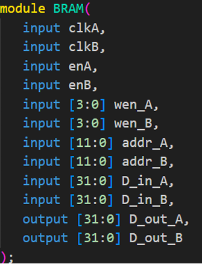
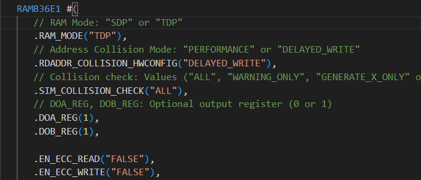
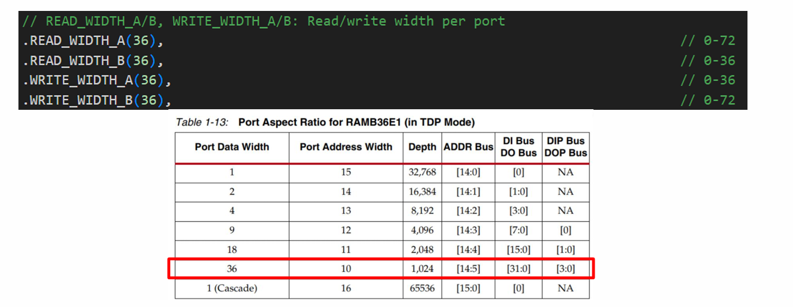
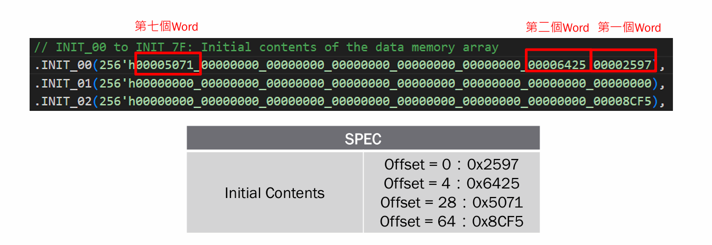
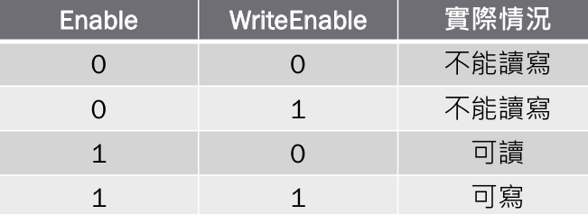
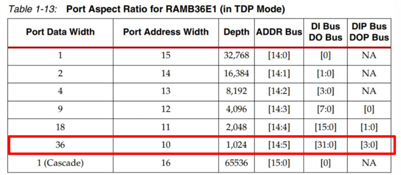
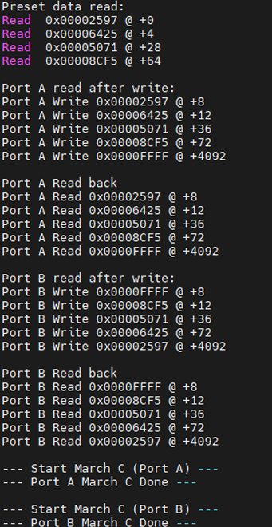

# FPGA Design Lab4

本次 lab 將介紹如何使用 AXI BRAM Controller，並學習直接透過 Verilog 語法呼叫 Block BRAM，也就是 `Verilog Template` 的設計方法，實作一個 On-Chip Memory System。

## 🛠️ Verilog Template vs Vivado IP Core
| 項目                  | 手寫 Verilog Template                      | 使用 Vivado IP Core (e.g. FIFO Generator) |
| ------------------- | ---------------------------------------- | --------------------------------------- |
| ⚙ **設計彈性**          | ✅ 高，可自定資料寬度、控制方式等                        | ❌ 中等，彈性依 IP 設定項目而定                      |
| 🔍 **可讀性 / 可維護性**   | ❌ 較低，需手動管理 FIFO 邏輯                       | ✅ 較高，IP 有圖形化介面與文檔支持                     |
| 🔄 **整合 Vivado BD** | ❌ 需手動 RTL instantiation 和 port mapping   | ✅ 自動整合，容易連接到 AXI/AXI-Stream             |
| 🧪 **驗證方便性**        | ❌ 較麻煩，需要自己寫 testbench 或與 AXI 對接          | ✅ 已知功能穩定，Xilinx 已驗證                     |
| 🧱 **資源使用效率**       | ✅ 可最佳化，依照特定需求裁剪資源                        | ❌ 通常較大、保守，為泛用性設計                        |
| ⏱ **開發時間**          | ❌ 長，需要開發與除錯                              | ✅ 快，幾分鐘內可產生並連接好                         |
| 📤 **時序優化與建議**      | ❌ 自己負責 reset、clock domain、timing closure | ✅ IP 通常已考慮 CDC/latency                  |
| 📚 **學習與理解價值**      | ✅ 非常好，幫助了解 FIFO / memory 實作              | ❌ 抽象化高，學習價值相對少                          |

## Verilog Template
主要分成兩個部分 : `Available Attributes` 、 `Port Descriptions`

1. `Available Attributes` : 可設定 Block RAM 的操作模式、初始值、資料寬度等等參數。

2. `Port Descriptions` : 定義 Block RAM 的 I/O Ports。

## Spec

## Bram controller 配置

AXI BRAM controller只會被分配到一個Address，只能控制一個 port ，因此本次設計為 `True Dual Port` 的情況下需使用到兩顆 AXI BRAM Controller ， 這樣子才能獲得兩個 Address 來給 BRAM 的 Port A、
Port B 做使用。

AXI protocol為Byte Addressable的，
而我們要控制的BRAM為32Kb的大小，
換算成Byte為32Kb / 8bit = 4KB，因此在
Range設定這邊需使用4K。

根據 `address path diagram `可以看到，分配給AXIBram Controller 的
0x4000_0000~0x4000_0FFF 經過 AXI Smart Connect 後就會變成 0x0~0xFFF，給後續32Kb(4KB)的BRAM做使用。

## RAMB36E1 template參數設置

### IP I/O

Addr Width 為 12bit，因為 `AXI protocol 為 Byte Addressable`的，32Kb
的記憶體需要用到 4K 的 range 去做定址，因此為 12bit-width。

Data Width 為 32bit，因此 input(D_in_X)、output(D_out_X) 的部分都設置為32bit。

---

### RAMB36E1 Available Attributes

根據 SPEC 要求，將 RAM_MODE 設置為 True Dual Port 
mode。

DOA_REG、DOB_REG 都設成 1，在
RAMB36E1 的 output 將會有一個額外的 Register 拿來儲存輸出的值，讓後續的電路可以有一個完整的 cycle 來
做存取資料。

`ECC`設置皆設定成 `FALSE`，因 RAMB36E1 設置成TDP模式時不能使用 ECC。

RAMB36E1 在 TDP 模式下，`Port Data Width` 只能設置成下方幾種數字，此次設計為 read/write width 
為 32bit 的 BRAM ，因此設置成 36bit ， 36bit 其中 32bit 為 data 另外4個 bit 為 Paritybit ，雖然 TDP 下不支援 ECC 但根據 xilinx 提供的文檔我們不能單純設置成 32bit 仍需設置成 36bit 才正確。

依 SPEC 要求，每 32 bit 為一個 word。 Offset 則為從 Base address 往後幾個 Byte，其中每4個 offset 代表 4 byte，亦即 1 word 。 E.g. offset=28，則將數值設置在第 7 個 word 上。

---

### RAMB36E1 Port Descriptions

RAMB36E1 在 True Dual Port (TDP) 模式下支援 `asynchronous clock domains`，Port A、Port 
B可以使用不同的clock。

因 RAMB36E1 支援 `Byte wise write`，因此 WriteEnable 訊號為 4bit，因為 32bit width
為 4Byte，WriteEnable 的 4 個 bit 各控制其中一個 Byte 的讀寫。

E.g.:若只要更新第一個byte，則WEA將被
設定成4’b0001

---

先前在 Avaliable attribute 時，有設定 output register ，而下圖兩個訊號則控制該
output register 是否去做更新，因此都設為1，使他保持更新 output register。

RAM input/output data 皆為 32-bit，而 DOADO()、DOBDO() 為 output dual port，DIADI()、
DIBDI() 為 input dual port。

---

RAMB36E1 實際上包含 36Kb 的容量，其中32Kb 用於資料儲存（Data Bits），額外的4Kb 則專門用來儲存 Parity Bits，這些位元只會在啟用 ECC 模式時使用。

RAMB36E1 支援最小資料寬度為 1-bit，因此若配置為 1-bit 模式，便需要 2^15 個地址才能存滿
32Kb。 Address Width 之所以設定為 16-bit，是因為：

> 實際地址需要15-bit 。
>
> 最前面保留的1-bit 是用來作為 cascade 模式（串接多個BRAM）時的選擇 bit。
>
> 因此總共需要16-bit 的地址輸入。

在使用 AXI BRAM Controller 時，addr_A 提供的是 `Byte Address`， 而 RAMB36E1 實際以每1 word = 32 bits = 4 bytes 為單位存取。因此在連接時需將最低 0～1 位元忽略，地址從 `addr_A[11:2]`開始使用，此處的位元表示的是第幾個 word 單位的地址。

根據xilinx提供的BRAM配置文檔可以看到，`Port Address Width = 10bit` 對應到我們設置的 addr_A[11:2]，ADDR Bus = [14:5] 則對應到 .ADDRARDADDR 裡面的第 14 個 bit到第2個 bit 剛好為 addr_A[11:2] 的位子。

---

### Utilization of BRAM

根據 `Utilization report` 可以看到 Pynq-z2 的 BRAM 共有 140 個可使用，而我們這次透過 `RAMB36E1 template` 實例化了一顆 dual port BRAM 使用了其中的 1 個 BRAM 。因此從上方 utilization report 看到我們BRAM 用了1/140 = 0.71%。

## Software Testing Result

---

## 進階練習 : 

使用 `Verilog Template` 的方法 ， 將 RAMB36E1 Configure 成 `36Kb FIFO` 。

>💡 **Hint：** 使用一顆 TDP mode 的 BRAM ，將要寫入 FIFO 的 Data 透過 PortA 寫入，要讀的 Data 透過 Port B 讀出。

