# Part4-BRAM

## What is BRAM?
BRAM（Block RAM）是 FPGA 內建的一種高速記憶體資源，專門用於儲存大量資料，可由`邏輯電路`或 `ZYNQ 的 ARM 核心` 進行讀寫。與外部記憶體（ DDR ）相比，BRAM 擁有更快的存取速度與更低的延遲，適合用於對速度與時序要求較高的應用。

## BRAM in Zynq-7020
Zynq-7000 系列中的 Zynq-7020 SoC，內部 PL 中提供：  

| 資源類型 | 數量 | 說明 |
| ------- | -----| --- |
| **36K BRAM blocks** | 140 個 | 每個 Block 為 36Kbits（4.5KB），可配置為 Single Port 或 Dual Port 記憶體 |
| **總容量** | 約 630KB | 合計容量為 140 × 4.5KB ≈ 630KB |

## Part 4.1 BRAM Configuration

1.  Create a New Vivado Project and Create a New Block Design

2.  加入 `Block Memory Generator`

    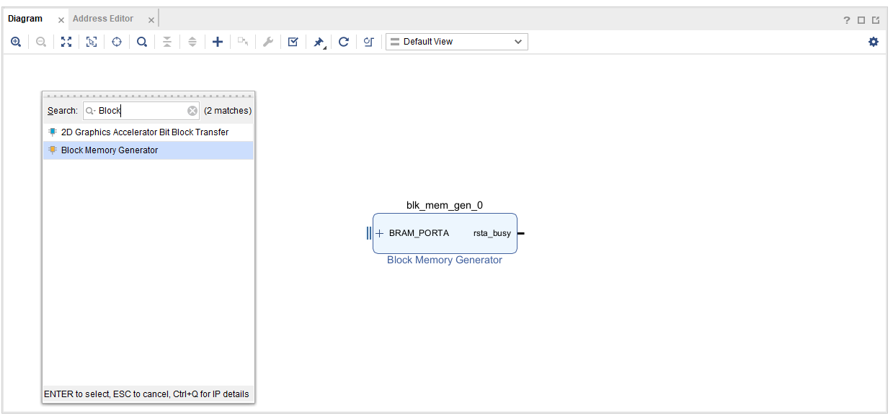

3.  進入該 IP 設定頁面  

      

### Mode:
| Mode | 說明 |
| ------- | ---- |
| **BRAM Controller** | 搭配 Vivado 中的 AXI BRAM Controller IP 使用，由 AXI 控制 BRAM Controller 來生成 BRAM 讀取寫入所需的訊號。可透過軟體端對該BRAM進行寫入讀取。 |
| **Standalone** | 不搭配 `BRAM Controller`來使用，無法由軟體直接存取，需由硬體自行管理資料的讀寫時序，但在**細節配置上更靈活**。|

### Memory Type:
| 記憶體類型 | 說明 |
| --------- | ---- |
| **Single Port RAM** | 單一讀寫 port，每個Clock內只能進行一次 Read 或 Write。 |
| **True Dual Port RAM** | 兩個獨立的讀寫 port（Port A 與 Port B），可同時或交錯進行兩筆資料的讀寫操作。 |
| **Simple Dual Port RAM**（部分版本中才有）| 一個 port 專門寫入、一個 port 專門讀出，**無法雙向操作**，適用於 FIFO 或資料搬移應用。 |
| **Single Port ROM** | 單 Port 唯讀記憶體，**僅支援讀取**，常用來初始化常數資料（如查找表 LUT）。 |
| **Dual Port ROM** | 雙 Port 唯讀記憶體，支援**兩組獨立的讀取存取**。 |

### Write Enable
| 選項  | 說明 |
| ---- | ---- |
| **Byte Write Enable** | 啟用後，允許以「Byte 為單位」進行選擇性寫入（例如：只改某一個 Byte，不影響整個 word），在 `BRAM Controller` 下預設開啟。 |
| **Byte Size (bits)**  | 指定一個「Byte」的大小，選項有：**8-bit（1 Byte）、9-bit（帶 parity bit）**。該選項會影響 Write Enable mask 的 bit 數。例如：若資料寬度為 32-bit、Byte Size 為 8-bit → 則會有 4-bit 的 write enable mask（每 bit 控制一個 Byte）。 |

### Standalone mode Port

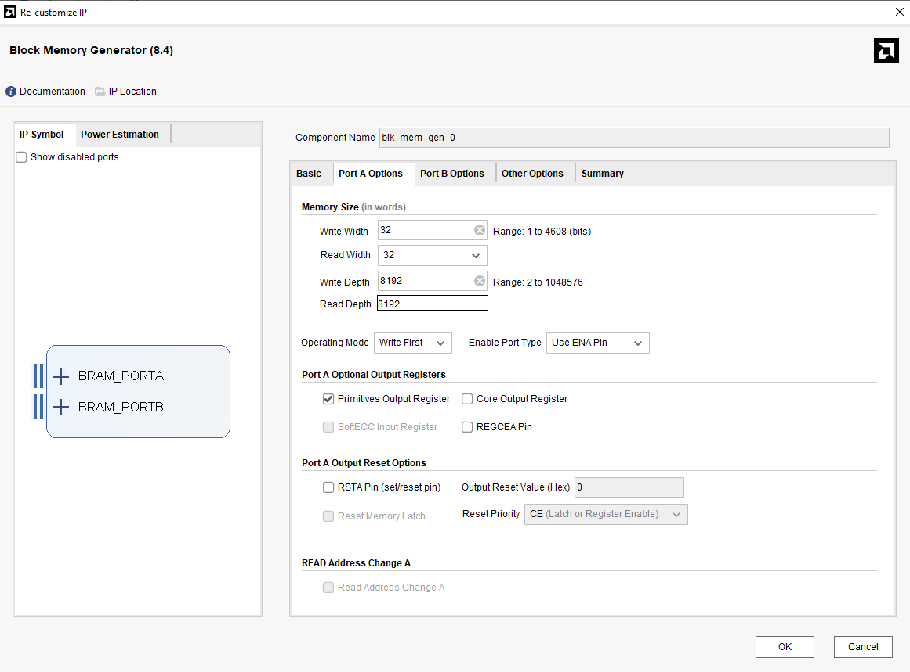  

| 欄位名稱 | 說明 |
| ------- | ---- |
| **Write Width / Read Width** | 資料的寫入與讀出 width（bit），該寬度即為 BRAM 內一個 word 的大小，在 `standalone` 模式下每個 address 就對應到一筆資料 (word)。 |
| **Write Depth / Read Depth** | 記憶體的深度（即有幾筆資料） |
| **Operating Mode** | BRAM 寫入行為 |
| **Enable Port Type** | 控制使能訊號，可設定成 `Use ENA Pin`，使用單獨的 ENA 腳位控制啟用，`Always Enabled`，永遠啟用 |
| **Primitives Output Register** | 啟用後，使用 BRAM 的輸出Register，會造成讀出資料的 delay 增加，但可以改善 `Critical Path` |
| **Core Output Register** | 從 IP 核心插入一級 Register，用於同步資料輸出，可改善改善 `Critical Path` |

### Operating Mode

`Operating Mode` 是用來控制當你對 BRAM 寫入資料時，輸出端（即 DO 或 DOUT）的行為。  

>   📌**寫資料的同時，輸出端到底要顯示什麼？**

#### Write First

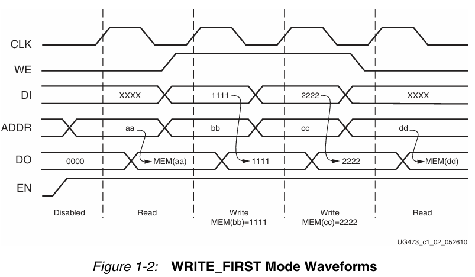

>   寫入資料與輸出同步更新。寫入 clock 觸發後，DOUT 立即反映寫入值。

#### Read First

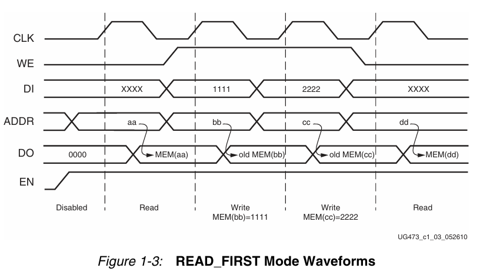

>   寫入 clock 觸發時，DOUT 輸出寫入位置的舊資料。

#### No Change

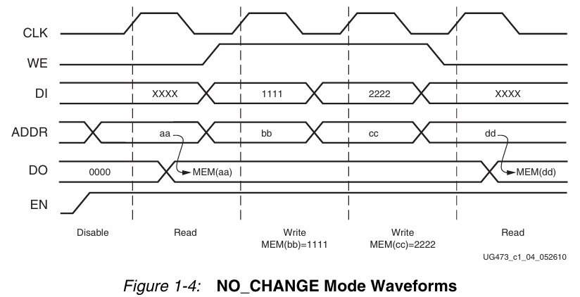

>   寫入 clock 觸發時，DOUT 保持前一次輸出的值不變。

### BRAM Controller mode Port

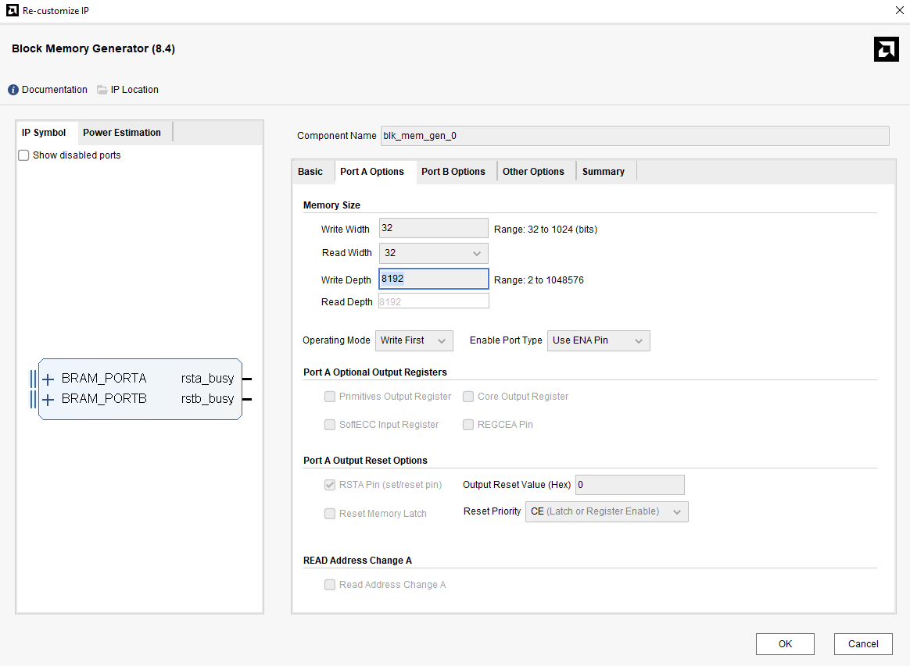

當你在 `Block Memory Generator IP` 中選擇 `BRAM Controller Mode` 時，該 IP 就不再是一個獨立的 BRAM，而是由 AXI BRAM Controller 所主控的記憶體資源。  

此時的 BRAM 是透過 AXI 總線與 PS 端進行資料交換，無法自行修改 `Write/Read Width`，所有設定皆由 AXI 接口協定所決定。

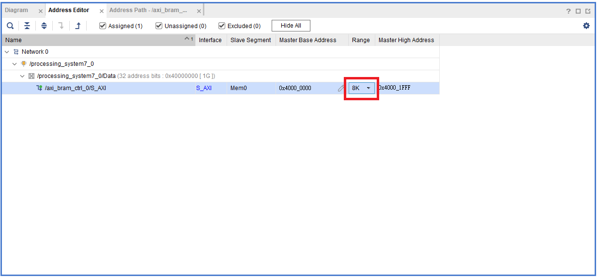

BRAM 的 `Depth` 不再由 `Block Memory Generator IP` 的介面設定，而是由 Vivado 的 Address Editor 中的 Address Map 來決定。  

### Memory Initialization

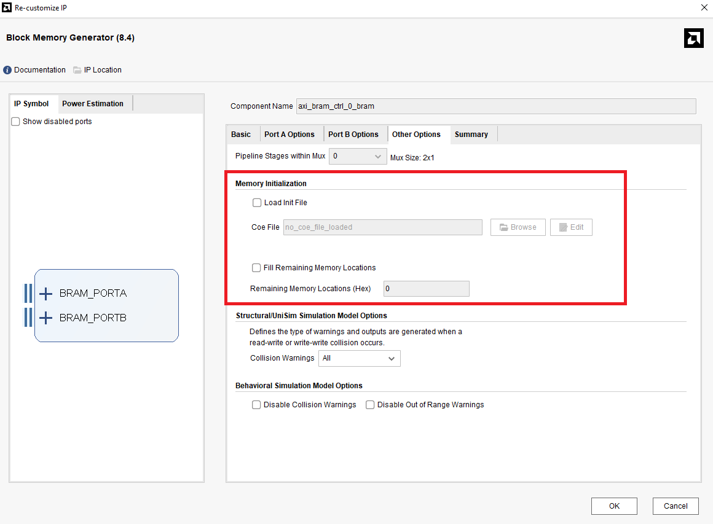

在 Standalone 模式 下使用 BRAM 時，記憶體的內容可以透過 `.coe` 檔案（Coefficient file） 進行初始化。

>   `.coe` 檔案是一種文字格式的記憶體初始化檔案，Vivado 會在產生 bitstream 時將其內容寫入 BRAM 中。

### BRAM Summary

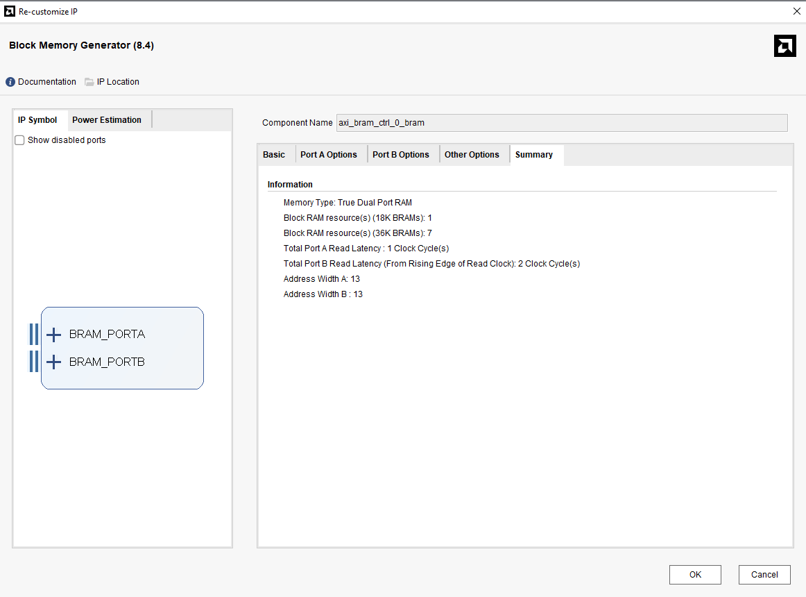

可以從該頁面看到所使用的 BRAM 數量跟 Port Read Latency

## Part 4.2 Standalone BRAM
在進行純硬體設計（Pure RTL or Block Design without Processor）的情境下，BRAM 是我們在 FPGA 裡最常用來儲存大量資料的元件。

**Standalone BRAM 請自行練習設計**，Standalone BRAM 使用上跟 ASIC Design的SRAM類似

## Part 4.3 BRAM Controller

1.  Create a New Vivado Project and Create a New Block Design

2.  加入 `ZYNQ7 Processing System`，並點選上方的 `Run Block Automation `

3.  將 `ZYNQ7 Processing System` 設定中的 `Peripheral I/O Pins`，全部取消並只勾選 `UART0`

    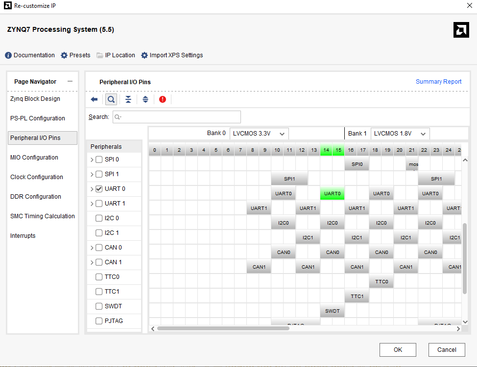

4.  加入 `AXI BRAM Controller`

    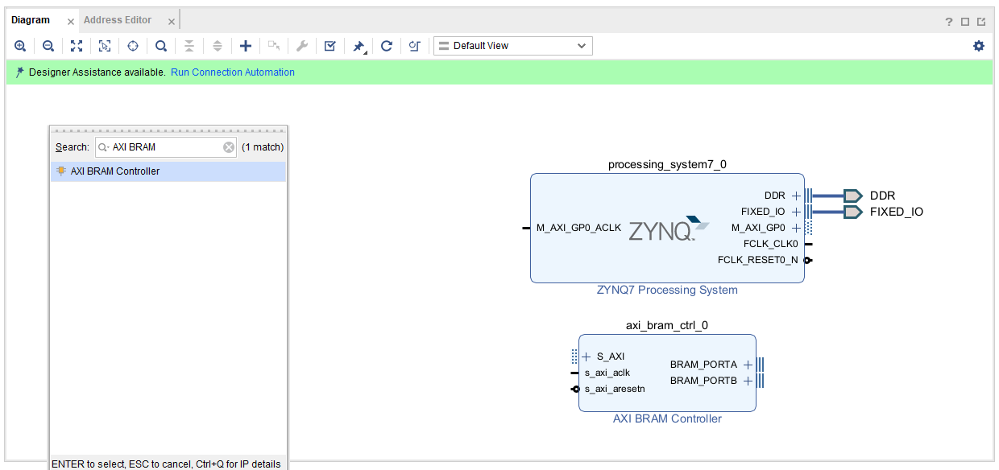

5.  點選左側選單 `Project Manager ->  Add Sources`，加入 `HDL/mul16.v`

    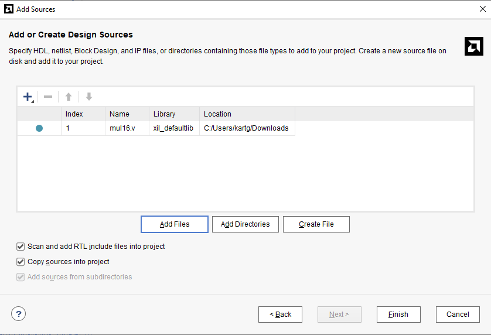

6.  將 `mul16.v` 加入 Block Design，可對 `mul16.v` 點右鍵按 `Add Module to Block Design` 或 直接拖曳到右邊的 Block Design  

    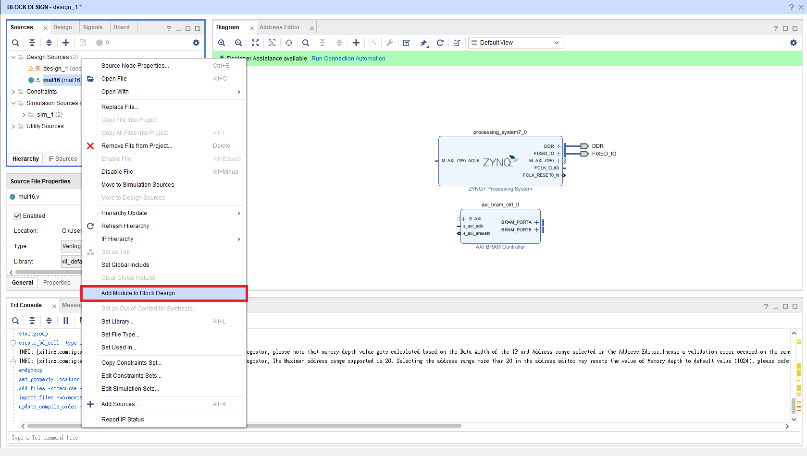  

7.  未連線前應該如下圖所示  

    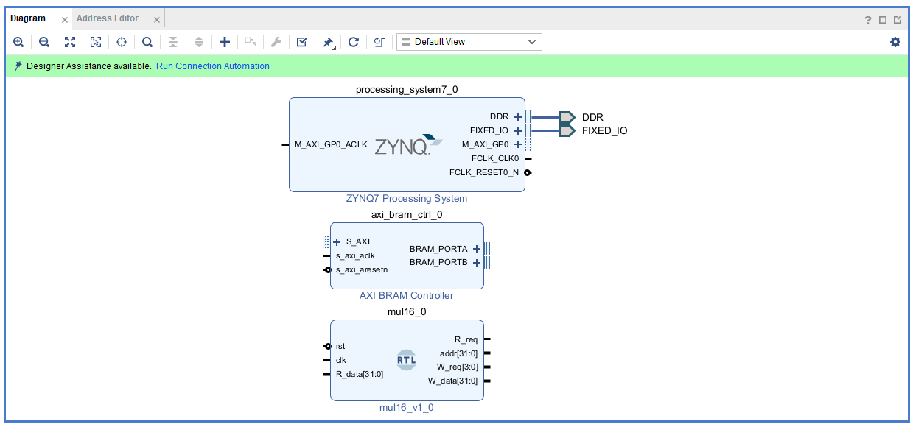

8.  點選上方 `Run Connection Automation`，除了 BRAM_PORTB 之外都勾選

    

9.  將 `Block Memory Generator` 設定成 TDP (True Dual Port)

    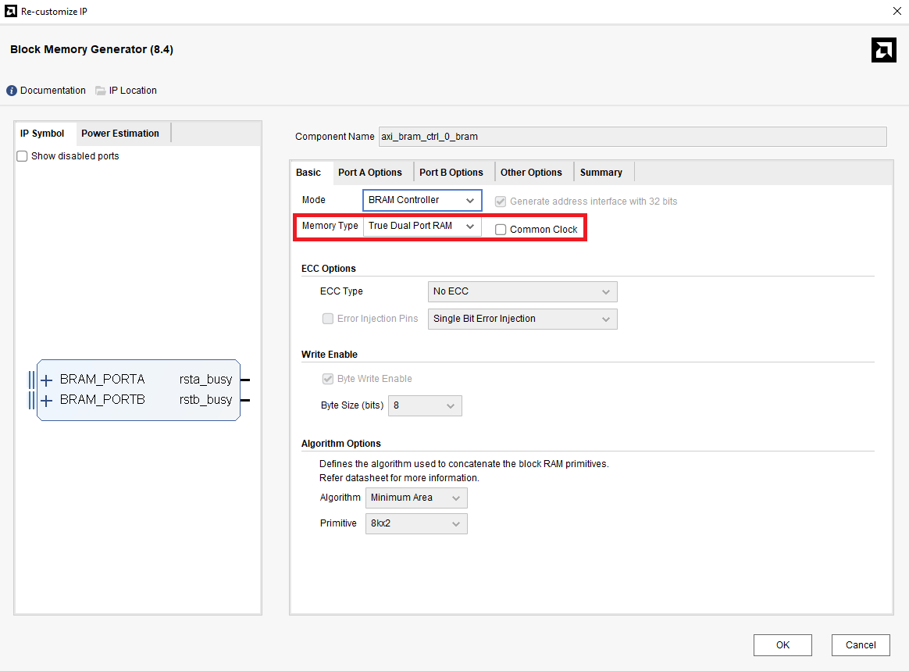

10. 將 `mul16` 接到 `Block Memory Generator`，必須手動一個一個接，其中`rstb` 為正緣觸發，必須接在 Process System Reset 的 `peripheral_reset` 上

    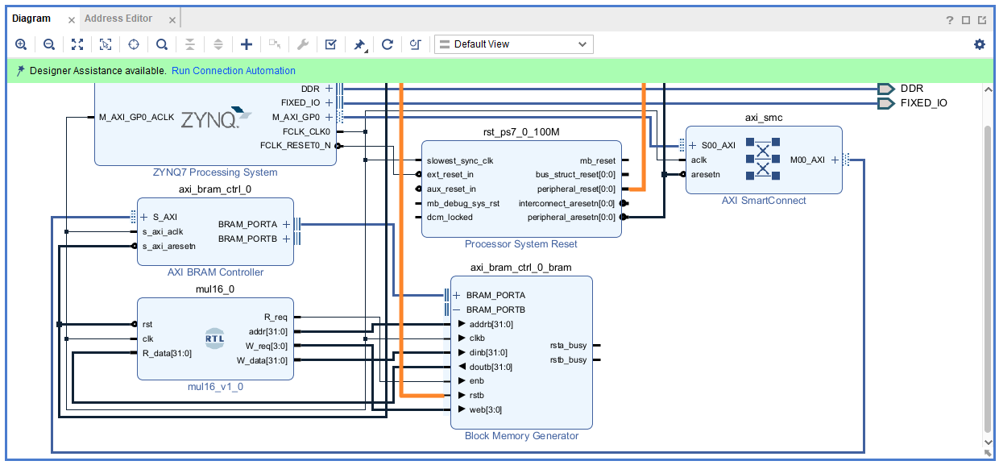

11. 將 `AXI BRAM Controller` 設定中，`Number of BRAM interfaces` 設定成 1  

    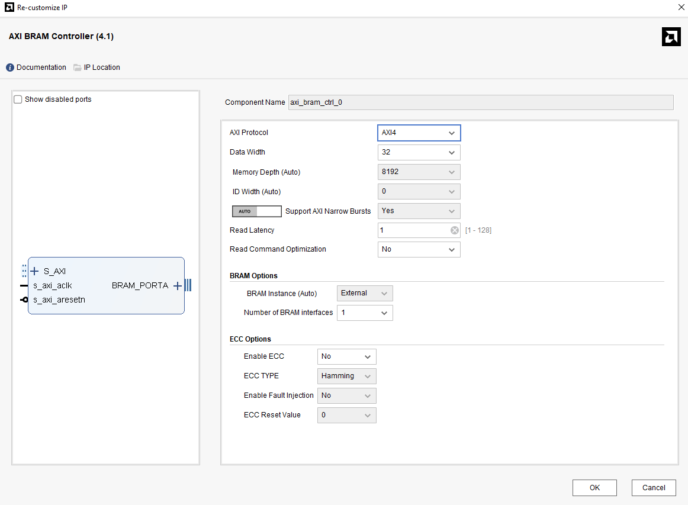

12. 電路設計完成圖  

    

13. `Create HDL Wrapper` -> `Generate Bitstream` -> `Export .xsa`

## Part 4.4 Vitis Project

1.  照 `Part1` 的方式創立一個 Vitis Project  

2.  使用 Part4.3 產生的 `.xsa` 檔案，創建 `Platform Component`  

3.  一樣使用 `Example Design` 裡面的 `Hello_World` 作為初始的 `Application Project`

4.  將 `Application Project` 內的 `hello_world.c` 替換成該次Lab裡面的`src/main.c`

5.  先 `build platform`

6.  再 `build application`

7.  連接上 PYNQ 板

8.  打開 `MobaXterm` Serial 方式連接上 PYNQ

9.  點選`Run`

## Part 4.5 Run & Result

-   將兩筆資料（60 和 20）寫入 BRAM 的特定位址

-   讓硬體邏輯（mul16 模組）自動讀取這兩筆資料、進行乘法

-   從 BRAM 的結果位址讀回硬體計算出來的乘積（應為 1200）

-   透過 UART 印出這些操作的過程與結果

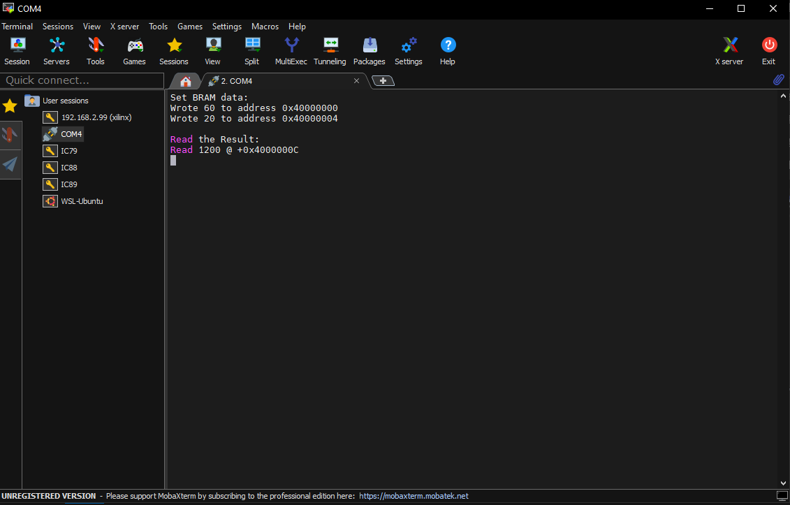
