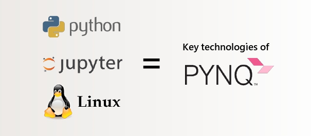

# Hardware-Software-Codesign

本章節將介紹如何在 Zynq 系列 FPGA 上進行軟硬體協同設計（Hardware-Software Codesign）。

## What's Zynq
Zynq 系列晶片將 **Programmable Logic（PL）** 與 **Processing System（PS）**整合在同一晶片中，實現軟體硬體的協同設計。

| 區塊 | 說明 |
| ---- | ---- |
| **PS (Processing System)**  | 內建 **雙核心 ARM Cortex-A9 處理器**，可執行 Linux / Baremetal 程式，具備記憶體與週邊控制 |
| **PL (Programmable Logic)** | 基於 28nm Artix-7 或 Kintex 架構的 FPGA，可實現運算加速、異質運算與自訂邏輯功能 |

## What's Pynq
PYNQ（Python Productivity for Zynq）是由 Xilinx 推出的開源框架，目的是讓開發者能夠以 Python 程式語言來控制 Zynq FPGA 中的硬體設計。

在 Zynq 設計傳統流程中，控制 FPGA 上的自訂邏輯通常需要：

-   使用 RTL 設計硬體電路

-   搭配 C/C++ 編寫韌體或軟體應用程式

-   交叉編譯

PYNQ 透過 Python 封裝與 Jupyter Notebook 介面，極大化簡化了傳統的軟硬體整合流程。

當硬體（Bitstream / Overlay）設計完成後，只需打開瀏覽器，即可透過 Jupyter Notebook 完成剩餘開發

| 元件 | 功能 |
| ---- | ---- |
| **Overlay (Bitstream)** | 將 Vivado 匯出的硬體設計包裝成一個可被 Python 控制的硬體模組 |
| **Python API** | 提供簡單的 Python class 來存取 FPGA 與記憶體 |
| **Jupyter Notebook** | 可在瀏覽器中撰寫 Python 程式並即時觀察執行結果 |

## 📘 推薦閱讀順序  

1. [Part1-Zynq-Processor](./Part1-Zynq-Processor/)
2. [Part2-AXI-GPIO](./Part2-AXI-GPIO/)
3. [Extra1-Vitis-Change-xsa](./Extra1-Vitis-Change-xsa/)
4. [Part3-AXI-Lite(未完)](./Part3-AXI-Lite/)
5. [Part4-BRAM(未完)](./Part4-BRAM/)
6. [Part5-DSP(未完)](./Part5-DSP/)
7. [Part6-PYNQ-Jupyter-Notebook](./Part6-PYNQ-Jupyter-Notebook/)
8. [Part7-CDMA(未完)](./Part7-CDMA/)