# Vivado Installation Guide

## Part 1. AMD account registration

1.  前往AMD官網辦理帳號 https://www.amd.com/zh-tw.html  

    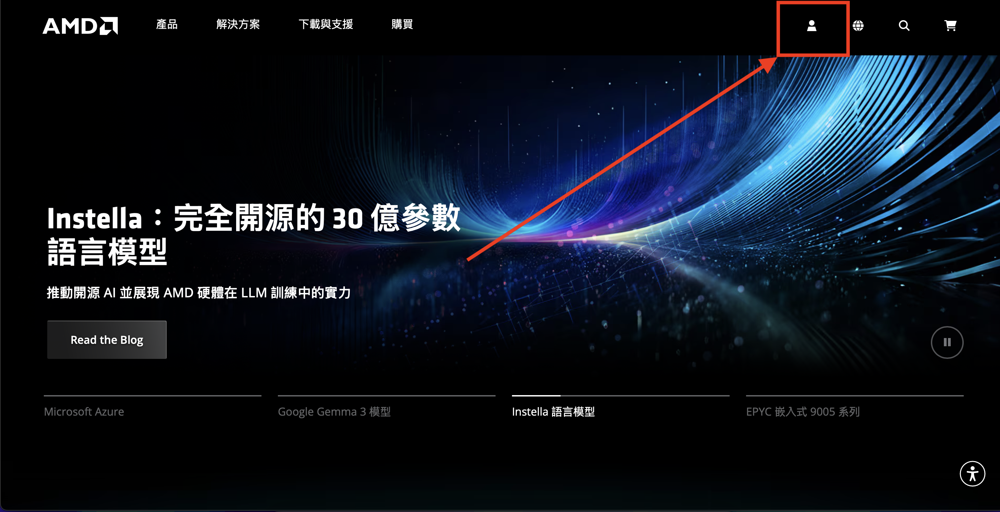

2.  辦好AMD帳號並登入後回到官網點選上方**下載與支援**當中的**Vivado ML**開發工具  

    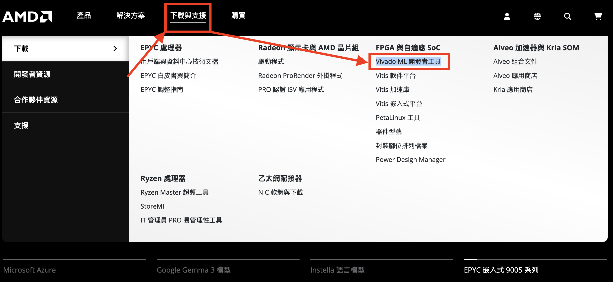

3.  選擇2023.2版本，之後的教學基本上都以2023.2為主  
    
    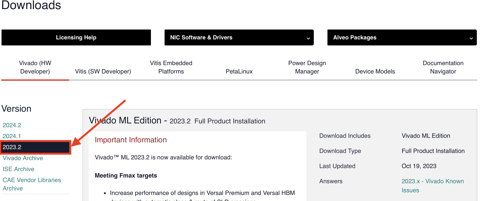
    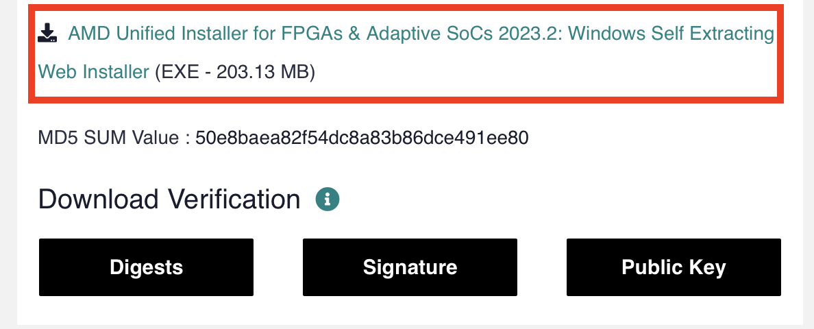

    填寫完資訊後按Download  
    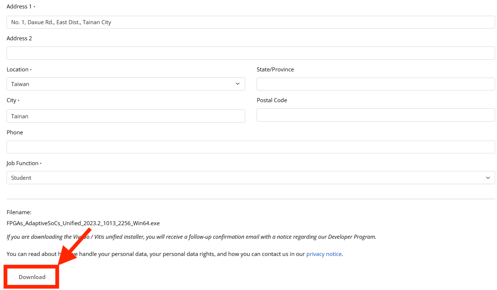

4.  點開剛剛下載好的檔案並登入剛才註冊的AMD帳號  
    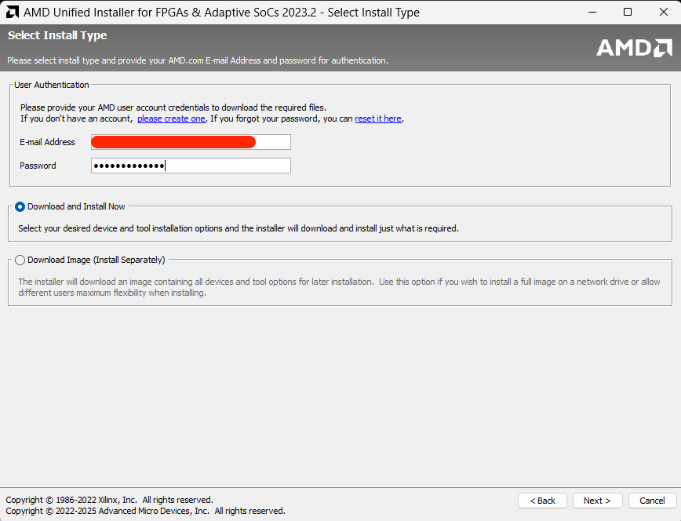
    
    選擇**Vitis**安裝整套工具包含軟體(Vitis)硬體(Vivado)的整合開發套件  
    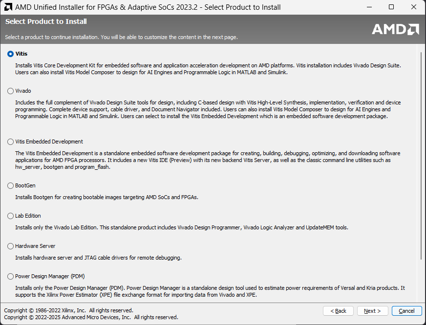

    根據您使用的FPGA板選擇對應的Device  
    KV260 -> Kria SOMs and Starter Kits  
    Pynq-Z2 -> SoC and 7 Series FPGAs  
    Zedboard -> SoC and 7 Series FPGAs  

    可以只選擇你所要用的FPGA板去做安裝，若Ultrascale也安裝將會使用到較多的空間  

    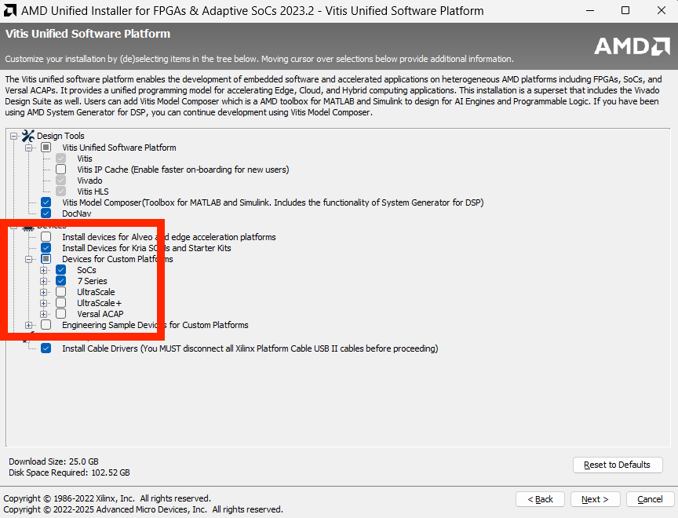 

5.  安裝路徑請一定不要有**中文**在內  
    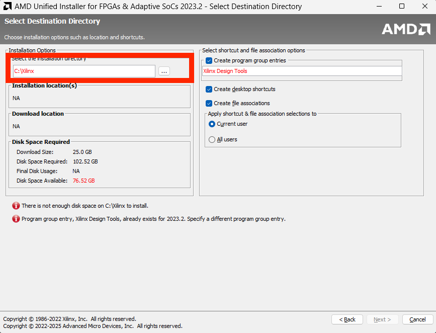

6.  等待下載完成就安裝好Vivado了  
    恭喜你後面就是痛苦的開始了d(`･∀･)b
## Part 2. FPGA Board file installation
若在之後創建Project選擇Boards時沒有你所使用的FPGA板，請參考以下步驟安裝FPGA板的檔案，以下將以Pynq-Z2為例。  

1.  比如說你在選擇板子時沒有看到Pynq-Z2的Board
    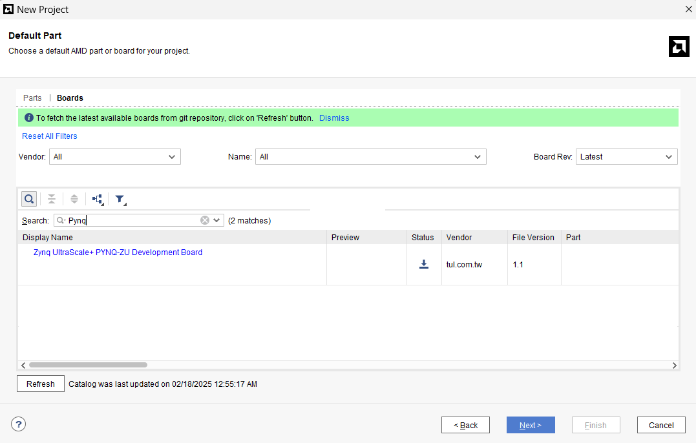

2.  前往Pynq-Z2的[官網](https://www.e-elements.com.tw/en/products-en/xup-pynq/pynq-z2/)下載**FPGA Board File和.XDC**  
  
    Board File -> 該檔案能讓你在 Vivado 裡直接選 PYNQ-Z2 這塊板子當 target board，並自動帶入正確的：  
	• FPGA 腳位對應（例如 HDMI、音訊、LED、Pmod 接口等）  
	• Zynq 處理器 preset 設定（包括時脈、RAM 配置等）

    Master XDC -> 內部有所有腳位對應的 XDC 檔案，該檔案會告知compiler將你的verilog宣告port連接到實體的pin腳上。
    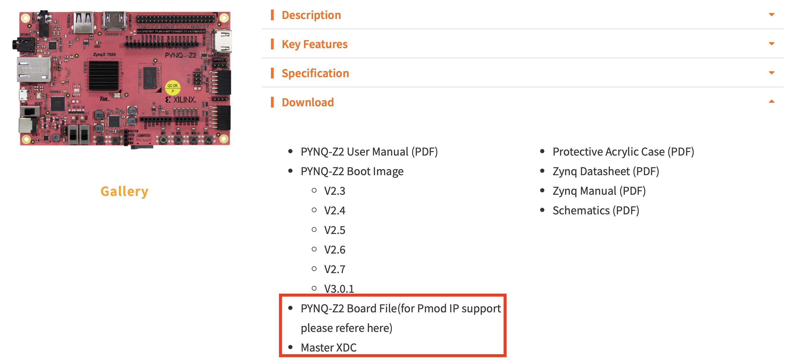

3.  將下載好的檔案解壓縮，並將Borad File(.xdc不用)資料夾放入Vivado的Board File路徑中  

    Vivado File path:  
    "C:\Xilinx\Vivado\2023.2\data\xhub\boards\XilinxBoardStore\boards\Xilinx"  

    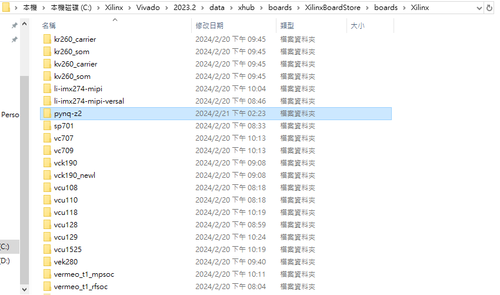  
    
    之後重新打開Vivado在創建Project時就能看到Pynq-Z2的Board了  

    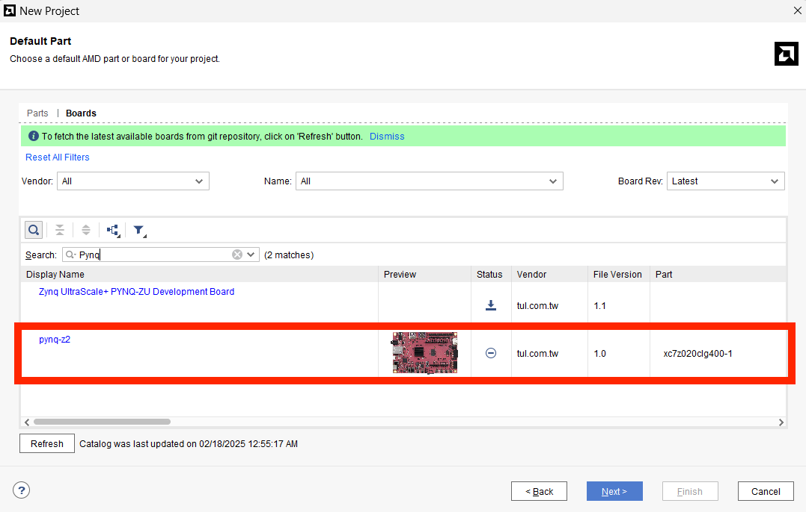    

    