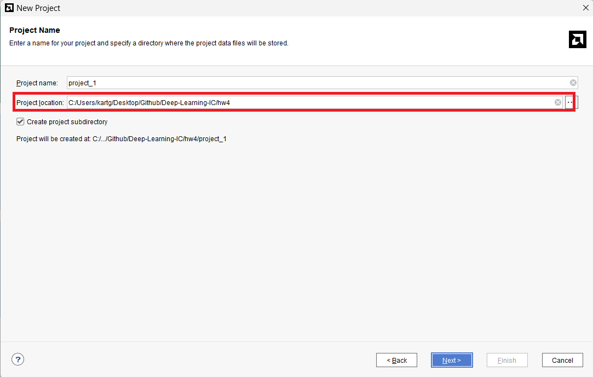
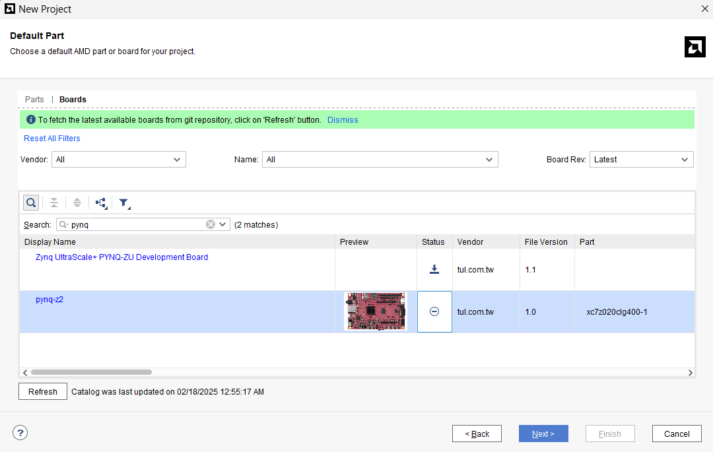
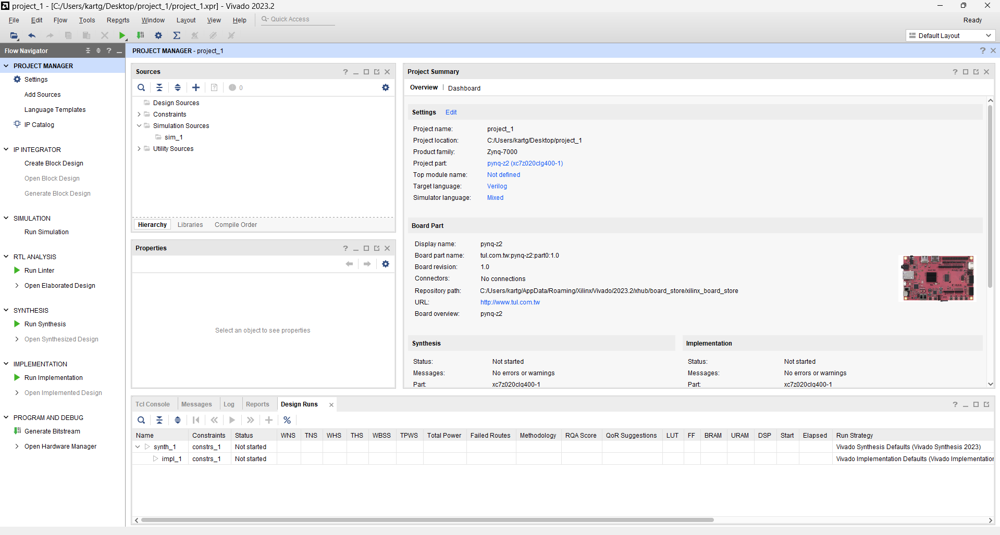
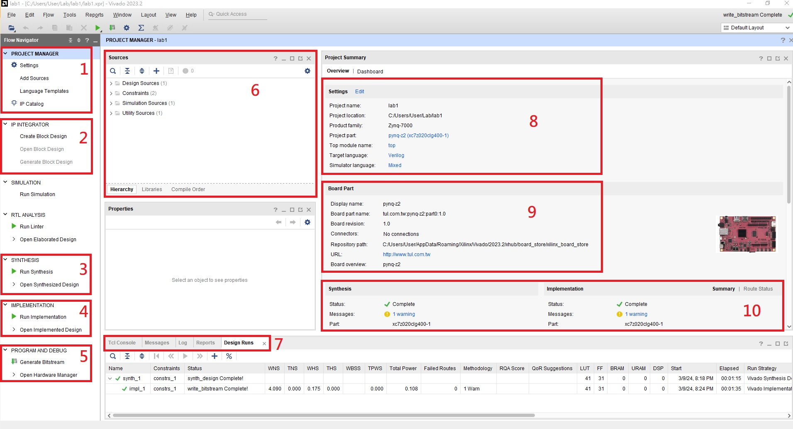

# Part1. Vivado Basic Tutorial
## Part 1.1 Create Vivado Project

1.  點開 Vivado 並且按下 Create Project  

      

2.  自行選擇路徑，切記路徑不得出現中文  

    

3.  選擇 RTL project ，若有寫好的 RTL code 則不必勾選 `Do not specify sources at this time`，可以在此階段將 RTL code 跟 Design Constraint import 進 project 中  

      

4.  選擇 FPGA Board ，這邊以 Pynq-Z2 做舉例  

      

5.  若成功創建 Project 後 Vivado 將呈現下方的畫面  

      

## Part 1.2 Introduction to Vivado Gui  

  

1.  Project Manager  

    整個 Project 的管理包括了 : 檔案管理 , 專案設定 , IP資料夾路徑等等，後續到了其他的設計階段(e.g. synthesis / implementation )要回到修改程式或新增檔案的部分都需按 `Project Manager` 回去才可以做修改。  

2.  IP Integrator

    以 `Block Design` 的方式來兜出整個系統，且可以加入 Xilinx 或是第三方所提供的 IP 來實作整個系統的設計

3.  Synthesis  

    將設計好的硬體描述檔合成成 FPGA 上由 CLB , Switch Box , Embedded Element 等元件所組成的實際電路

4.  Implementation  

    將合成好的實際電路擺放到 FPGA 上的確切位置 (Floor & Plan)

5.  Program And Debug  

    Generate Bitstream : 將 Implementation 完的電路編譯成一個燒錄進 FPGA 的位元串流檔

6.  Sources  

    管理 `Design Sources` , `Constraints` , `Simulation Sources`

7.  Tcl Console  

    使用指令的方式來實作 Project (在 GUI 上每個點選的動作其實都有相對應的一條指令，也會顯示在這邊)  

    Message : 任何系統訊息, warning, error 都會顯示在這，若在實作 project 時卡關建議先到這裡找問題  

    Log : 紀錄 Project 歷程  

    Reports : 回報 synthesis & implementation 如 timimg, power, utilization 等資訊  

    Design Runs : 顯示軟體現在正在進行什麼步驟  

8.  Project Summary  

9.  當前使用之FPGA資訊  

10. Synthesis & Implementation 之 Summary

## Part 1.3 simple led control 