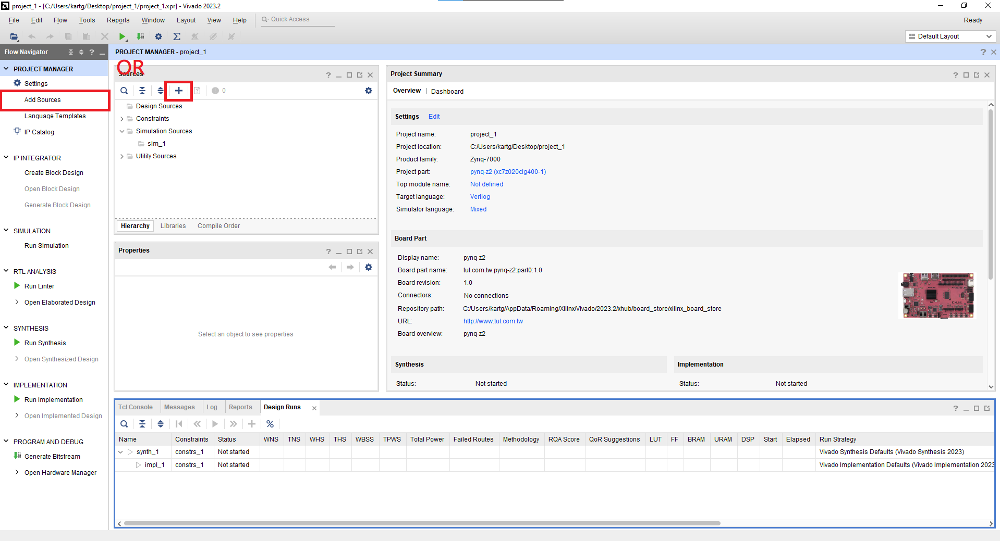

# Part2. RTL Design & Simulation
此次教學將使用先前在 `Part1` 創立好的 Project ，匯入預先準備好的 RTL 設計與 Testbench 檔案，並透過 Vivado 進行模擬驗證。

## Part 2.1 Open Project and Add Source File

1.  開啟 Vivado，點選左側選單中的 **Open Project**  
2.  瀏覽至專案資料夾，選取副檔名為 `.xpr` 的檔案（例如 `project_1.xpr`）並開啟

    

3.  在 Flow Navigator 中點選  
    **Project Manager → Add Sources**  
    或從 **Source** 區塊點選 **+**  
    

4. **Add Source 選單：**

   當你點選 `Add Sources` 後，會出現如下畫面，Vivado 提供三種不同類型的來源檔案加入方式：

   - `Add or create constraints`  
     用來新增或建立 `.xdc` 檔案（約束檔），指定 IO 腳位與時序條件。常在專案後期或實作階段使用。

   - `Add or create design sources`  
     加入你的 RTL 設計檔案（例如 `.v`、`.vhdl`）。這是你撰寫邏輯功能的主程式碼。

   - `Add or create simulation sources`  
     匯入 Testbench 模擬檔案（例如 `.tb.v`），這些檔案只會用於模擬階段，**不會參與Synthesis** 。

    
 