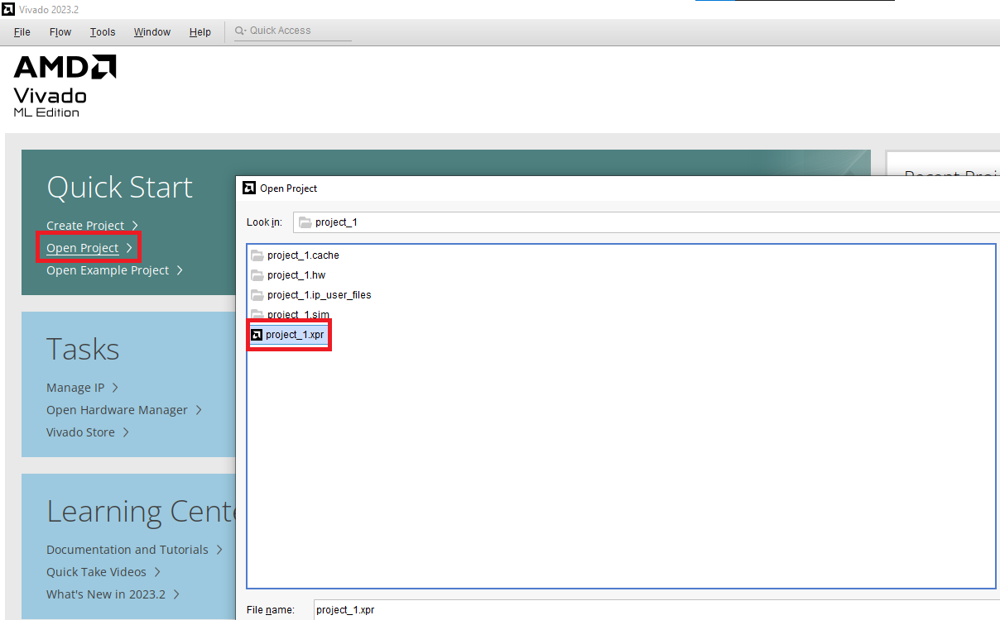
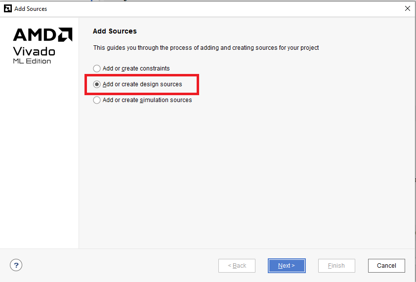
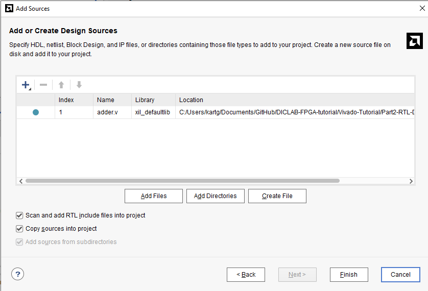
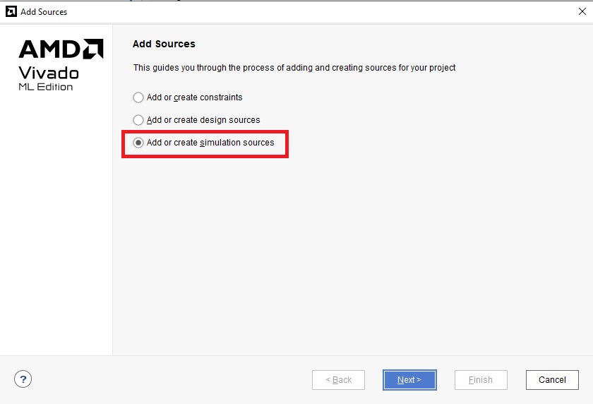
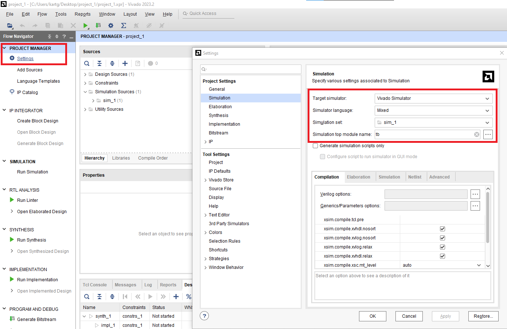
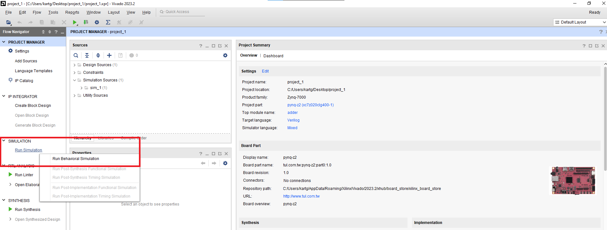
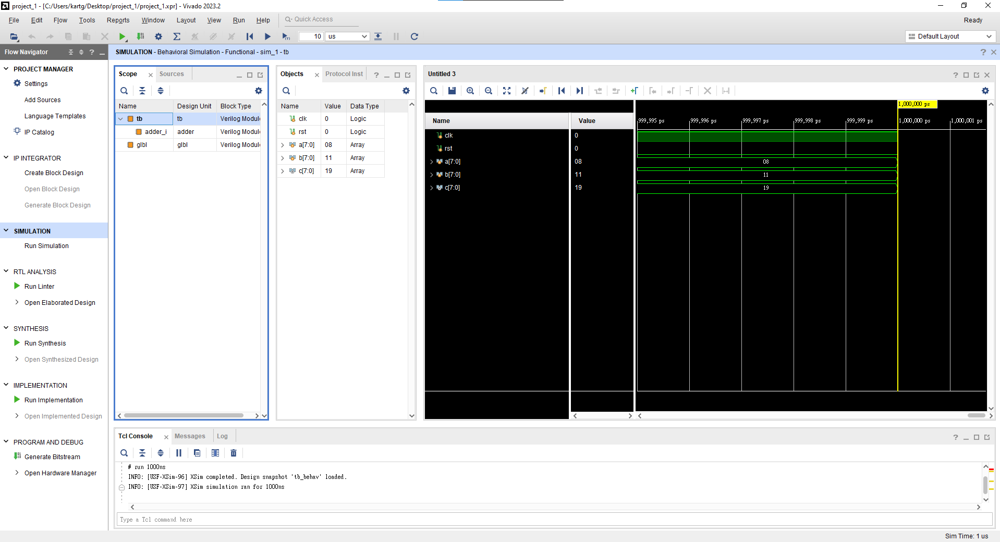

# Part2-RTL-Design-Simulation
此次教學將使用先前在 `Part1` 創立好的 Project ，匯入預先準備好的 RTL 設計與 Testbench 檔案，並透過 Vivado 進行模擬驗證。

## Part 2.1 Open Project and Add Source File

1.  開啟 Vivado，點選左側選單中的 **Open Project**  
2.  瀏覽至專案資料夾，選取副檔名為 `.xpr` 的檔案（例如 `project_1.xpr`）並開啟

    

3.  在 Flow Navigator 中點選  
    **Project Manager → Add Sources**  
    或從 **Source** 區塊點選 **+**  

    

4. **Add Source 選單：**

   當你點選 `Add Sources` 後，會出現如下畫面，Vivado 提供三種不同類型的來源檔案加入方式：

   - `Add or create constraints`  
     用來新增或建立 `.xdc` 檔案（約束檔），指定 **IO 腳位與時序條件**。常在專案後期或實作階段使用。

   - `Add or create design sources`  
     加入你的 RTL 設計檔案（例如 `.v`、`.vhdl`）。這是你撰寫的電路主程式碼。

   - `Add or create simulation sources`  
     匯入 Testbench 模擬檔案（例如 `tb.v`），這些檔案只會用於模擬階段，**不會參與Synthesis** 。

    此次操作先選擇 `Add or create design sources`

      

    將 `RTL` 資料夾內的`adder.v`加入當中  
    
      

    再重複操作一次選擇 `Add or create simulation sources` 

    

    將 `RTL` 資料夾內的`tb.v`加入當中  

      

    > Note: 可以透過 Simulation set 管理多組simulation設定，例如不同的 testbench 或模擬條件。本教學使用預設的 `sim_1`，並將 RTL 資料夾內的 `tb.v` 加入即可。未來在設計較大型的電路時，可以根據不同的 module 建立對應的 simulation set，以進行模組化測試與除錯。
    >

## Part 2.2 Simulation

1.  點選左上角的 `Project Manager` ，再點選 `Settings`  
    `simulation set` 的地方選擇剛剛設定的 `sim_1`

      

    - **Target simulator**：選擇 `Vivado Simulator`
    - **Simulator language**：選擇 `Mixed` 或 `Verilog`
    - **Simulation set**：預設為 `sim_1`，可切換其他模擬設定
    - **Simulation top module name**：輸入你的 Testbench 名稱（例如 `tb`）

    一個 Simulation Set（例如 sim_1）是 Vivado 中用來設定一組simulation環境的集合。  
       
    每組 Simulation Set 都可以對應：  
    - **一份或多份 Testbench**

    - **一個 Top Module**

2.  點選左側的 `Simulation` 選擇 `Run Behavior Simulation`  

    

3.  操作正確就可以看到如下方的波型圖  

    

## Additional  

[Extra1-Linter](../Extra1-Linter/)
