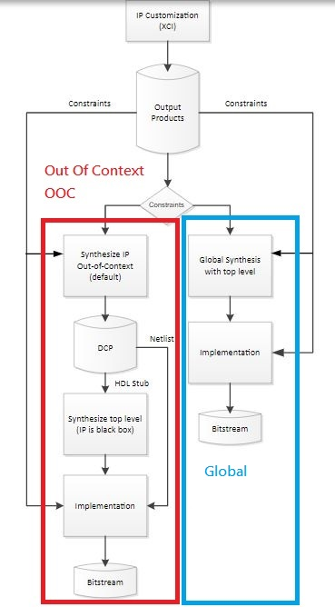

# Part4-1-IP-Package

## Hard IP / Soft IP 差異

在 FPGA 與 ASIC 設計中，常見兩種 IP（Intellectual Property）形式：

- **Hard IP**：  
  指已經經過 Placement and Routing 的電路模組，通常以實體電路形式嵌入在晶片中（如 Zynq 系列中的 ARM Cortex-A9 核心、DDR 控制器）。它的時序、面積與功耗特性固定，效能高但可攜性差。

- **Soft IP**：  
  軟 IP 是用 HDL 撰寫的模組，設計彈性高，可以在不同製程與平台上重新合成與實作。 Vivado 提供的大多數 IP 皆屬於 Soft IP，你可以看到它們通常會有 RTL 原始碼或是可以在 Synthesis 階段生成電路邏輯，就屬於 Soft IP。

在本教學中，我們將以 **Soft IP 的封裝流程為主**，學習如何將自己的 RTL 模組包裝成可在 Vivado Block Design 中使用的自訂 IP。

##  Design Constraints of IP

在 Vivado 封裝 IP 的流程中，Constraints 必須根據使用場景分開處理，主要分為兩種：

1.  Global
當 IP 是整個 SoC 設計的一部分時，IP 所需的時脈與 I/O 限制將由上層設計的 `.xdc` 提供，此時 IP 本身的 `.xdc` 不需要再定義 clock，否則可能產生重複定義錯誤

2.  Out-of-Context（OOC）
Vivado 預設會對每個 IP 執行 `OOC synthesis`，產生 `.dcp(design check point)` 
為了讓 IP 在 `OOC` 環境下能正確綜合，必須提供一份獨立的 .xdc 來定義：`create_clock`、`set_input_delay`、`set_output_delay`  

>📌 Out-of-Context（OOC）合成是指 Vivado 在 IP 尚未接入 Top-level design前，會單獨對該 IP 進行合成與分析。
在這個階段，Top-level 設計會將該 IP 視為一個 functional black box，不關心其內部邏輯細節，只關心其 interface 與功能行為是否正確。  
>
>📌 相對地，在 Global 設計情境下，**IP 被整合進整體系統**，由上層設計統一提供時脈與 I/O 限制，因此 IP 本身的 .xdc 中通常只保留必要的內部限制，並避免重複定義上層的 constraint。

# Part4.1.1 Package Your IP

1.  在包裝 IP 的過程中，有時候會需要開數個暫時拿來使用的 Vivado Project，這邊我們先創建一個新的 Vivado Project，並將`/RTL/RGB_LED.v` 和 `/XDC/RGB_LED_ooc.xdc` 加入專案當中

2.  